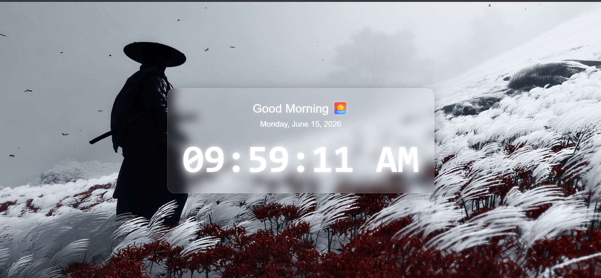

# ⏰ Digital Clock

A modern and responsive **Digital Clock** built using **HTML, CSS, and JavaScript**. This project displays the current time in real-time with a beautiful glassmorphism interface, dynamic greetings, and date display.



## ✨ Features

* 🕒 Real-time clock updates every second
* 🌞 12-hour format with AM/PM indicator
* 📅 Current date display
* 👋 Dynamic greetings based on time:

  * Good Morning 🌅
  * Good Afternoon ☀️
  * Good Evening 🌙
* 🎨 Modern Glassmorphism UI
* 📱 Fully Responsive Design
* 🌄 Custom Background Image
* ⚡ Lightweight and Fast

## 🛠️ Technologies Used

* HTML5
* CSS3
* JavaScript (ES6)

## 📂 Project Structure

```
digital-clock/
├── assets/
│   ├── BackGround.jpeg
│   └── clock-preview.png
├── index.html
├── index.css
├── index.js
└── README.md
```

## 🚀 Getting Started

### Clone the Repository

```bash
git clone https://github.com/kothurisaiteja/digital-clock.git
```

### Navigate to the Project Folder

```bash
cd digital-clock
```

### Run the Project

Open `index.html` in your preferred web browser.

## 📸 Preview

The application features a stunning full-screen background with a glassmorphism card displaying:

* Greeting Message
* Current Date
* Live Digital Clock

## 🎯 Learning Outcomes

Through this project, I gained hands-on experience with:

* JavaScript Date Object
* DOM Manipulation
* setInterval()
* String Formatting
* Responsive Web Design
* CSS Glassmorphism Effects

## 🔮 Future Improvements

* 24-Hour Format Toggle
* Multiple Time Zone Support
* Dark/Light Theme Switch
* Alarm Functionality
* Stopwatch and Timer Integration

## 🌐 Live Demo

https://kothurisaiteja.github.io/digital-clock/

## 👨‍💻 Author

**Sai Teja**

GitHub: https://github.com/kothurisaiteja

---

⭐ If you found this project useful, consider giving it a star!
